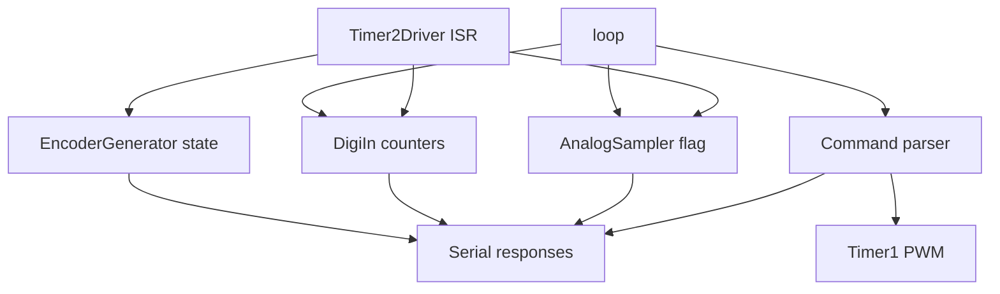

# PlatformIO Arduino Uno Project

Basic PlatformIO project targeting the Arduino Uno (ATmega328P).

## IOFusion design

IOFusion is a small set of hardware helpers focused on deterministic, timer-driven sampling and signal generation:

- `Timer2Driver` provides a periodic ISR tick for scheduling fast tasks.
- `AnalogSampler` defers ADC reads to `loop()` while the ISR only sets a flag.
- `DigiIn` samples digital inputs in the ISR and computes frequency/duty in `loop()`.
- `EncoderGenerator` produces a quadrature output and tracks position/direction.
- `Timer1PWM` configures Timer1 PWM on OC1A/OC1B (pins 9/10).

### Encoder generator semantics

`EncoderGenerator` is a **signal generator** driven by two level inputs (`up`, `down`). It advances one quadrature step per tick when `up` is HIGH and `down` is LOW, and steps backward when `down` is HIGH and `up` is LOW. It does **not** decode a physical quadrature encoder.

### Data flow




### Timing model

- **ISR path:** minimal work only (flags + counters). No floating-point math.
- **Main loop:** performs ADC reads and computes frequency/duty, ensuring the ISR stays fast.

#### Timing contract (important)

To keep measurements accurate, `loop()` should run frequently. If the loop stalls for long periods, analog sampling and digital window updates will lag. As a rule of thumb, keep worst-case loop latency well below the digital measurement window duration.

#### Analog reference voltage

`AnalogSampler` scales readings using a configurable reference voltage (default 5.0V). If your board uses a different $V_{ref}$, set it at startup with `analogSampler.setVref(<volts>)` after `begin()`.

### Source layout

- Library headers: [lib/IOFusion/include](lib/IOFusion/include)
- Library sources: [lib/IOFusion/src](lib/IOFusion/src)
- Firmware entry: [src/main.cpp](src/main.cpp)
- Command line interface: [src/cmdline.h](src/cmdline.h) and [src/cmdline.cpp](src/cmdline.cpp)

## Command line interface

The firmware exposes a simple serial command line for querying sensors and controlling PWM. Commands are ASCII and return JSON-like responses.

Supported commands:

- `analog?` — returns analog voltages for configured channels.
- `digital?` — returns frequency and duty cycle for configured digital inputs.
- `encoder?` — returns encoder direction and position.
- `pwm-freq <hz>` — sets Timer1 PWM frequency.
- `pwm-duty <ch> <pct>` — sets PWM duty for channel 0 or 1.
- `help` — prints a short help string.

#### Error reporting

Initialization failures are reported as JSON errors on Serial (e.g., `{"error":"pwm init failed"}`) to aid diagnosis.

## Build and upload

Build with PlatformIO:

```bash
pio run
```

Upload to a connected Uno:

```bash
pio run --target upload
```

## Unit tests and coverage

Host-based unit tests (IOFusion library) run under a native build with mocked Arduino APIs:

- Windows: run [tools/coverage.ps1](tools/coverage.ps1)
- Linux/macOS: run [tools/coverage.sh](tools/coverage.sh)

Reports are generated in the `coverage/` directory (`index.html` and `coverage.xml`).
