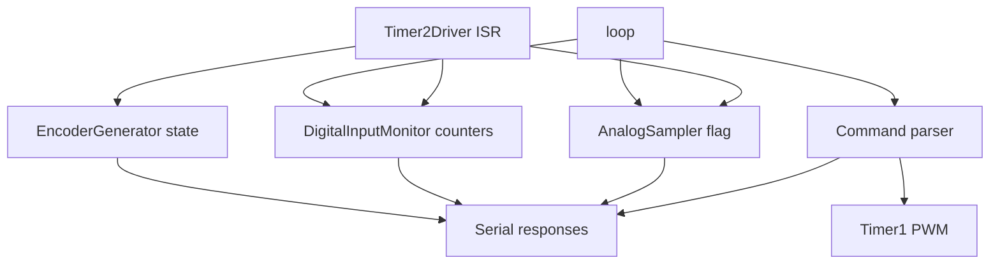

# PlatformIO Arduino Uno Project

> **Project scope:** IOFusion is intentionally **Arduino-focused** (Uno-class targets). Cross-platform HAL expansion is out of scope for now.

> Docs index: [docs/md/INDEX.md](docs/md/INDEX.md)
> - Architecture: [docs/md/ARCHITECTURE.md](docs/md/ARCHITECTURE.md)
> - PlatformIO library install/publish/use: [docs/md/PLATFORMIO_LIBRARY.md](docs/md/PLATFORMIO_LIBRARY.md)
> - Coverage limitations: [docs/md/COVERAGE_LIMITATIONS.md](docs/md/COVERAGE_LIMITATIONS.md)
> - Example sketches: [docs/md/EXAMPLES.md](docs/md/EXAMPLES.md)
> - Examples quick start: [examples/README.md](examples/README.md)
> - Release process: [docs/md/RELEASES.md](docs/md/RELEASES.md)
> - API reference: [docs/md/API_REFERENCE.md](docs/md/API_REFERENCE.md)

## Quick start (60 seconds)

```bash
# 1) Clone + install deps
 git clone https://github.com/djwinter29-oss/arduino-iofusion.git
 cd arduino-iofusion
 python3 -m venv .venv && source .venv/bin/activate
 pip install -r requirements.txt

# 2) Run native unit tests
 pio test -e native -v

# 3) Build for Arduino Uno
 pio run -e uno

# 4) Upload an example-ready firmware (main app)
 pio run -e uno -t upload
 pio device monitor -b 115200
```

Arduino-focused library package with a reference firmware for Arduino Uno-class targets.

## IOFusion design

IOFusion is a small set of hardware helpers focused on deterministic, timer-driven sampling and signal generation:

- `Timer2Driver` provides a periodic ISR tick for scheduling fast tasks.
- `AnalogSampler` defers ADC reads to `loop()` while the ISR only sets a flag.
- `DigitalInputMonitor` samples digital inputs in the ISR and computes frequency/duty in `loop()`.
- `EncoderGenerator` produces a quadrature output and tracks position/direction.
- `Timer1PWM` configures Timer1 PWM on OC1A/OC1B (pins 9/10).

#### DigitalInputMonitor measurement limits

`DigitalInputMonitor` is a sampled digital estimator, not a hardware input-capture peripheral. It observes each pin once per timer tick, counts sampled HIGH time, and counts sampled rising edges over a fixed window. That has a few direct consequences:

- Pulses narrower than one tick can be missed entirely.
- If the signal toggles faster than half the tick rate, aliasing is unavoidable.
- Frequency resolution is one counted edge per window: $\Delta f = \frac{\text{tickHz}}{\text{windowTicks}}$.
- Duty-cycle resolution is one sample per window: $\Delta duty \approx \frac{100}{\text{windowTicks}}\%$.

For reliable square-wave style measurements, keep the input frequency comfortably below Nyquist; as a practical rule, target $f_{in} \le \frac{\text{tickHz}}{4}$ if both duty and edge count matter. For higher-frequency or narrow-pulse measurements, use hardware capture or edge interrupts instead of `DigitalInputMonitor`.

In the default reference firmware configuration, `DigitalInputMonitor` runs at 10 kHz with a 500-tick window ([apps/reference_firmware/src/main.cpp](apps/reference_firmware/src/main.cpp)). That yields a 50 ms measurement window, about 20 Hz frequency resolution, and about 0.2% duty resolution, with best results on signals well below 2.5 kHz.

### Encoder generator semantics

`EncoderGenerator` is a **signal generator** driven by two level inputs (`up`, `down`). By default it treats those controls as logic-driven, active-HIGH inputs: it advances one quadrature step per tick when `up` is asserted and `down` is not, and steps backward when `down` is asserted and `up` is not. For direct switch wiring to ground, initialize it with `usePullup=true` and `activeHigh=false`. It does **not** decode a physical quadrature encoder.

### Data flow



```mermaid
flowchart TD
    T2[Timer2Driver ISR] --> AS[AnalogSampler flag]
    T2 --> DI[DigitalInputMonitor counters]
    T2 --> EN[EncoderGenerator state]

    LOOP[loop] --> AS
    LOOP --> DI
    LOOP --> CMD[Command parser]

    CMD --> PWM[Timer1 PWM]
    CMD --> RESP[Serial responses]

    AS --> RESP
    DI --> RESP
    EN --> RESP

```

### Timing model

- **ISR path:** minimal work only (flags + counters). No floating-point math.
- **Main loop:** performs ADC reads and computes frequency/duty, ensuring the ISR stays fast.

#### Timing contract (important)

To keep measurements accurate, `loop()` should run frequently. If the loop stalls for long periods, analog sampling and digital window updates will lag. As a rule of thumb, keep worst-case loop latency well below the digital measurement window duration.

For `DigitalInputMonitor`, also size `tickHz` and `windowTicks` around the actual signal envelope you need to observe. A larger window improves stability and resolution but increases latency; a faster tick improves observability but increases ISR load.

#### Analog reference voltage

`AnalogSampler` scales readings using a configurable reference voltage (default 5.0V). If your board uses a different $V_{ref}$, set it at startup with `analogSampler.setVref(<volts>)` after `begin()`.

### Source layout

- Library headers: [lib/IOFusion/include](lib/IOFusion/include)
- Library sources: [lib/IOFusion/src](lib/IOFusion/src)
- Reference firmware entry: [apps/reference_firmware/src/main.cpp](apps/reference_firmware/src/main.cpp)
- Reference firmware CLI: [apps/reference_firmware/include/firmware_cli.h](apps/reference_firmware/include/firmware_cli.h) and [apps/reference_firmware/src/firmware_cli.cpp](apps/reference_firmware/src/firmware_cli.cpp)

### Configuration model

The library is intentionally Arduino-specific, but board wiring is left to the caller. Public setup APIs now provide typed `Config` structs so pin assignments, timing parameters, pull-up policy, and frequency selection stay explicit and readable at the call site.

IOFusion intentionally keeps configuration lightweight: it does not perform exhaustive runtime checks for overlapping pin assignments or timer-resource conflicts across modules. In the intended Arduino/Uno use case these mappings are chosen up front, remain effectively compile-time design decisions, and do not rely on dynamic allocation or late resource discovery. It is the caller's responsibility to ensure configured pins and timer users do not overlap.

## Command line interface

The firmware exposes a simple serial command line for querying sensors and controlling PWM. Commands are ASCII and return JSON-like responses.

Supported commands:

- `analog?` — returns analog voltages for configured channels.
- `digital?` — returns frequency and duty cycle for configured digital inputs.
- `encoder?` — returns encoder direction and position.
- `pwm-freq <hz>` — sets Timer1 PWM frequency.
- `pwm-duty <ch> <pct>` — sets PWM duty for channel 0 or 1.
- `help` — prints a short help string.

#### Error reporting

Initialization failures are reported as JSON errors on Serial (e.g., `{"error":"pwm init failed"}`) to aid diagnosis.

## Use as a PlatformIO library

This repository now includes a `library.json` manifest so it can be published to the PlatformIO Registry.

### Local dependency usage (before publishing)

In another PlatformIO project:

```ini
lib_deps =
  https://github.com/djwinter29-oss/arduino-iofusion.git
```

### Publish to PlatformIO Registry

1. Ensure `library.json` fields are correct (name/version/authors/repository).
2. Bump `version` for each release.
3. Publish:

```bash
pio pkg publish --type library
```

4. If needed, unpublish a bad version:

```bash
pio pkg unpublish --type library --owner <owner> --name IOFusion --version <x.y.z>
```

An example sketch is provided at `examples/basic_usage/basic_usage.ino`.

## Build and upload

Build with PlatformIO:

```bash
pio run
```

Upload to a connected Uno:

```bash
pio run --target upload
```

## Unit tests and coverage

Host-based unit tests (IOFusion library) run under a native build with mocked Arduino APIs:

- Native coverage intentionally targets loop-side and parser logic only.
- AVR register drivers (`Timer1PWM`, `Timer2Driver`) are excluded from host coverage and should be validated on real hardware.

- Windows: run [tools/coverage.ps1](tools/coverage.ps1)
- Linux/macOS: run [tools/coverage.sh](tools/coverage.sh)

Reports are generated in the `coverage/` directory (`index.html` and `coverage.xml`).
